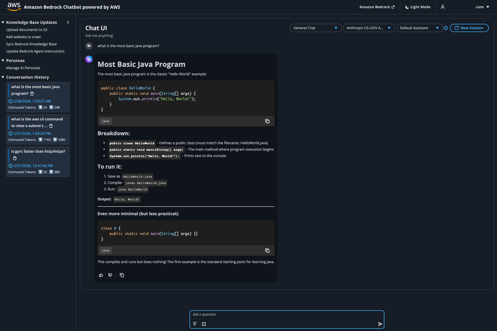
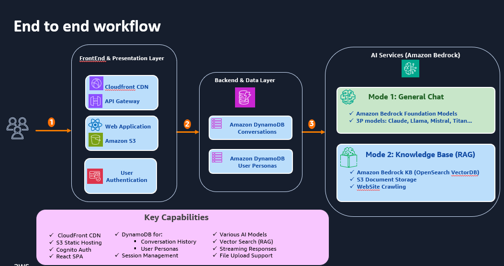
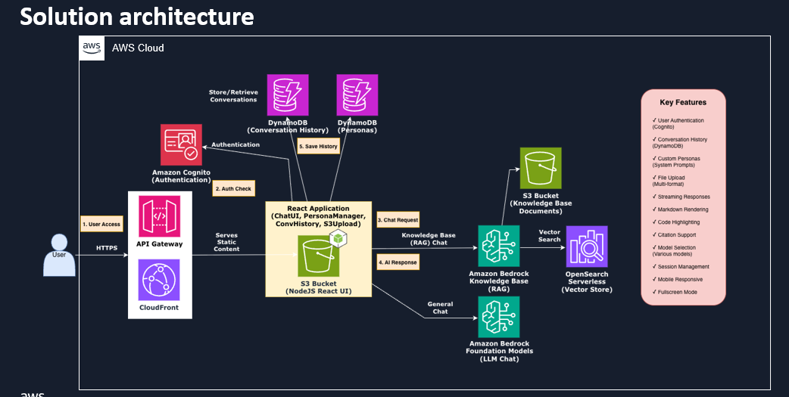

# Serverless Amazon Bedrock React Chatbot

This is a sample Amazon Bedrock powered serverless chatbot that's deployed through Infrastructure as Code and creates a user-friendly chatbot solution that can be deployed quickly, in both commercial and GovCloud. This solution includes conversation history functionality, allowing users to reference and continue previous interactions seamlessly. This solution incorporates Personas and Retrieval-Augmented Generation (RAG) for context-aware conversations, which means the chatbot can maintain relevant, intelligent dialogue based on specific roles and knowledge bases. Additionally, this system provides token usage estimates per conversation, giving estimated visibility into consumption metrics. Finally, this solution supports file uploads for document summarization and analysis, enabling users to extract insights from their documents directly through the chat interface.

**Note: This solution is designed for Proof of Concept (POC) usage and is not intended for production deployment.**

## Table of Contents

- [Serverless Amazon Bedrock React Chatbot](#serverless-amazon-bedrock-react-chatbot)
  - [Table of Contents](#table-of-contents)
  - [✨ Features](#-features)
  - [🖥️ UI and Architecture Diagram](#️-ui-and-architecture-diagram)
  - [📁 Project Structure](#-project-structure)
  - [🚀 Deployment](#-deployment)
  - [🔒 Deploying in an Isolated VPC with VPC Endpoints](#-deploying-in-an-isolated-vpc-with-vpc-endpoints)
    - [API Gateway Resource Policy (PRIVATE Endpoints)](#api-gateway-resource-policy-private-endpoints)
  - [⚙️ Runtime Configuration (Config API)](#️-runtime-configuration-config-api)
  - [🔄 Redeploying the Web App](#-redeploying-the-web-app)
  - [🗑️ Tearing Down the Deployment](#️-tearing-down-the-deployment)
  - [📚 Additional Documentation](#-additional-documentation)
  - [📄 License](#-license)

## ✨ Features

- Conversational AI powered by Amazon Bedrock Agents and Knowledge Bases (RAG)
- Streaming and non-streaming response modes with markdown and syntax highlighting
- Conversation history with per-session token usage (DynamoDB-backed)
- Personas with custom instructions and document context (S3-backed)
- Knowledge base management with document upload and website crawling
- Real-time knowledge base sync and ingestion status
- Document viewer with PDF and DOCX support, including citation highlighting
- Support for multiple model selections
- Cognito-based authentication with email domain restriction
- Automated CI/CD pipeline (CodePipeline + CodeBuild) triggered on S3 upload
- CloudFront distribution with WAF, security headers, and OAC (commercial)
- API Gateway with REGIONAL or PRIVATE endpoint support (GovCloud)
- Full VPC endpoint support for isolated/private deployments
- Infrastructure as Code with KMS encryption, access logging, and least-privilege IAM

## 🖥️ UI and Architecture Diagram

Example screenshot:\


End-to-End Workflow:\


Architecture diagram:\


## 📁 Project Structure

```
sample-bedrock-serverless-react-chatbot/
├── WebApp/                          # React frontend application
│   ├── src/                         # React source code
│   ├── public/                      # Static assets
│   └── package.json                 # Node.js dependencies
├── Infrastructure/                  # AWS infrastructure deployment
│   ├── CloudFormation/              # CloudFormation templates
│   │   ├── foundation.yaml          # Shared infrastructure (KMS, S3, DLQ)
│   │   ├── bedrock.yaml             # Bedrock Agent and Knowledge Base
│   │   ├── cognito.yaml             # User authentication
│   │   ├── config-api.yaml          # Config API (SSM Parameter Store, Lambda, API Gateway) - both commercial and GovCloud
│   │   ├── cicd.yaml                # CI/CD pipeline
│   │   ├── cloudfront.yaml          # CloudFront distribution (commercial)
│   │   ├── cloudfront-waf.yaml      # WAF WebACL (us-east-1 only, commercial)
│   │   └── apigateway.yaml          # API Gateway for UI hosting (GovCloud, REGIONAL or PRIVATE)
│   ├── deploy.sh                    # Main deployment script
│   ├── destroy.sh                   # Teardown script (deletes all stacks)
│   ├── lambda_layer_py313.zip       # Python dependencies for Lambda
│   ├── cors-config.json             # CORS configuration
│   └── vpc-config.json.sample       # Sample VPC endpoint configuration
```

## 🚀 Deployment

⚠ Ensure your AWS CLI has a valid session with permissions necessary for deploying CloudFormation stacks

1. Clone the repository and navigate to the Infrastructure directory.
```bash
git clone https://github.com/aws-samples/sample-bedrock-serverless-react-chatbot.git
cd sample-bedrock-serverless-react-chatbot/Infrastructure
```

2. Execute the deploy script with required parameters:
```bash
./deploy.sh --stack-name my-br-bot --email-domain example.com
```

   - `--stack-name` (required): Base name for all CloudFormation stacks (max 12 characters)
   - `--email-domain` (required): Email domain for user registration (e.g., example.com)

   **Optional parameters:**
   - `--model-id <id>` — Bedrock foundation model ID (auto-detected for commercial/GovCloud)
   - `--agent-name <name>` — Name for the Bedrock Agent
   - `--kb-name <name>` — Name for the Knowledge Base
   - `--api-gateway-name <name>` — Name for API Gateway (GovCloud only)
   - `--api-gateway-endpoint-type <type>` — `REGIONAL` or `PRIVATE` (GovCloud only, default: `REGIONAL`)
   - `--vpc-id <vpc-id>` — VPC ID (required when endpoint type is `PRIVATE`)
   - `--vpc-config <path>` — Path to VPC endpoint config file (default: `vpc-config.json`)
   - `--stream-responses <bool>` — Enable/disable streaming responses (default: `true`)
   - `--model-name <name>` — Bedrock model display name (default: empty)
   - `--model-provider <provider>` — Bedrock model provider (default: `Anthropic`)
   - `--chat-type <type>` — Default chat type: `LLM` or `RAG` (default: `LLM`)
   - `--max-tokens <number>` — Maximum tokens for model responses (default: `4096`)
   - `--guardrail-id <id>` — Bedrock Guardrail ID (default: empty)
   - `--guardrail-version <version>` — Bedrock Guardrail version (default: empty)
   - `--debug` — Print full CloudFormation commands for troubleshooting
   - `--rollback` — Delete all stacks created by a previous deployment

3. Check the CloudFormation outputs section for your CloudFront distribution link (commercial) or API Gateway URL (GovCloud) and test out your new RAG Chatbot!

## 🔒 Deploying in an Isolated VPC with VPC Endpoints

For environments that require private connectivity (no internet access), the solution supports deployment into an isolated VPC using VPC Endpoints (VPCEs) and a private API Gateway.

1. **Create VPC Endpoints** in your VPC for the following services:
   - `execute-api` — API Gateway
   - `dynamodb` — DynamoDB
   - `bedrock` — Bedrock
   - `bedrock-runtime` — Bedrock Runtime
   - `bedrock-agent` — Bedrock Agent
   - `bedrock-agent-runtime` — Bedrock Agent Runtime
   - `s3` — S3

2. **Create the VPC config file** from the sample:
```bash
cp Infrastructure/vpc-config.json.sample Infrastructure/vpc-config.json
```

3. **Edit `vpc-config.json`** and populate it with your VPC ID and VPCE DNS names. Note: for S3 interface endpoints, use the base DNS name without the `*.` wildcard prefix.

4. **Deploy with private API Gateway:**
```bash
cd Infrastructure
./deploy.sh --stack-name my-br-bot --email-domain example.com --api-gateway-endpoint-type PRIVATE
```

The script reads `vpc-config.json` automatically and passes the VPCE URLs to the relevant CloudFormation stacks. The VPC ID is read from the config file, or can be overridden with `--vpc-id`.

### API Gateway Resource Policy (PRIVATE Endpoints)

When deploying with `--api-gateway-endpoint-type PRIVATE`, the API Gateway resource policy controls which traffic can invoke the API. The templates handle two scenarios:

- **VPCE ID provided** (via `vpc-config.json` or `--vpc-config`): The resource policy restricts access to requests originating from that specific VPC Endpoint (`aws:sourceVpce` condition). This is the most restrictive option.
- **VPCE ID not provided**: This covers situations where a VPC Endpoint for `execute-api` has not yet been deployed. The resource policy falls back to allowing requests from the entire VPC using the `aws:sourceVpc` condition with the VPC ID. This is less restrictive but ensures the API is accessible while VPC Endpoints are being provisioned.

For REGIONAL endpoints, no resource policy is applied.

## ⚙️ Runtime Configuration (Config API)

The solution uses a Config API backed by AWS Systems Manager Parameter Store to deliver runtime configuration to the web app. This is deployed in both commercial and GovCloud regions. It eliminates the need to hardcode Bedrock, DynamoDB, and VPCE settings as environment variables in the frontend build.

> **Note:** Once Lambda streaming is supported in AWS GovCloud, all AWS service interactions will flow through API Gateway and Lambda.

The `config-api` stack deploys:
- SSM Parameters for all Bedrock, DynamoDB, and VPCE configuration values
- A Lambda function that reads all parameters and returns them as JSON
- An API Gateway (Cognito-authorized) that exposes a `GET /config` endpoint
- A WAF WebACL with rate limiting and managed rule sets
- Gateway responses with CORS headers for error responses

In commercial regions, the Config API Gateway is a separate REGIONAL API Gateway from the CloudFront distribution that serves the UI. In GovCloud, both the UI-serving API Gateway (`apigateway.yaml`) and the Config API Gateway (`config-api.yaml`) are deployed as separate REST APIs. The Config API supports the same PRIVATE endpoint configuration as the UI API Gateway when deploying in an isolated VPC.

On page load, the web app calls the Config API with the user's JWT token and caches the response in `sessionStorage`. All config values (regions, table names, model IDs, etc.) are then available at runtime via proxy objects in `aws-config.js`.

The Config API URL is set via the `VITE_CONFIG_API_URL` environment variable in `WebApp/.env.local`. The CICD stack also receives this URL and injects it during builds.

## 🔄 Redeploying the Web App

After making changes to the web app source, zip and upload to the react-code S3 bucket. The CICD pipeline (EventBridge → CodePipeline → CodeBuild) automatically triggers a build and deploys the updated files.

```bash
cd WebApp
zip -r ../Infrastructure/reactapplication.zip public src package.json index.html vite.config.js
cd ../Infrastructure
REACT_CODE_BUCKET=$(aws cloudformation describe-stacks --stack-name <stack-name>-foundation \
  --query "Stacks[0].Outputs[?OutputKey=='ReactCodeBucket'].OutputValue" --output text)
aws s3 cp reactapplication.zip s3://$REACT_CODE_BUCKET/
rm reactapplication.zip
```

Replace `<stack-name>` with your base stack name (e.g. `my-br-bot`). No manual build or CloudFront invalidation is required.

## 🗑️ Tearing Down the Deployment

To delete all resources created by `deploy.sh`, use `destroy.sh`:

```bash
cd Infrastructure
./destroy.sh --stack-name my-br-bot
```

This deletes stacks in reverse dependency order: CloudFront/API Gateway → CICD → Config API → Cognito → Bedrock → Foundation. It also empties versioned S3 buckets and cleans up retained resources.

Options:
- `--yes` or `-y` — Skip the confirmation prompt
- `--keep-retained` — Don't delete buckets with `DeletionPolicy: Retain`

Alternatively, `deploy.sh --rollback` performs the same teardown.

## 📚 Additional Documentation

- **Contributing**: See [CONTRIBUTING.md](CONTRIBUTING.md) <!-- TODO -->

## 📄 License

This library is licensed under the MIT-0 License. See the [LICENSE](LICENSE) file.